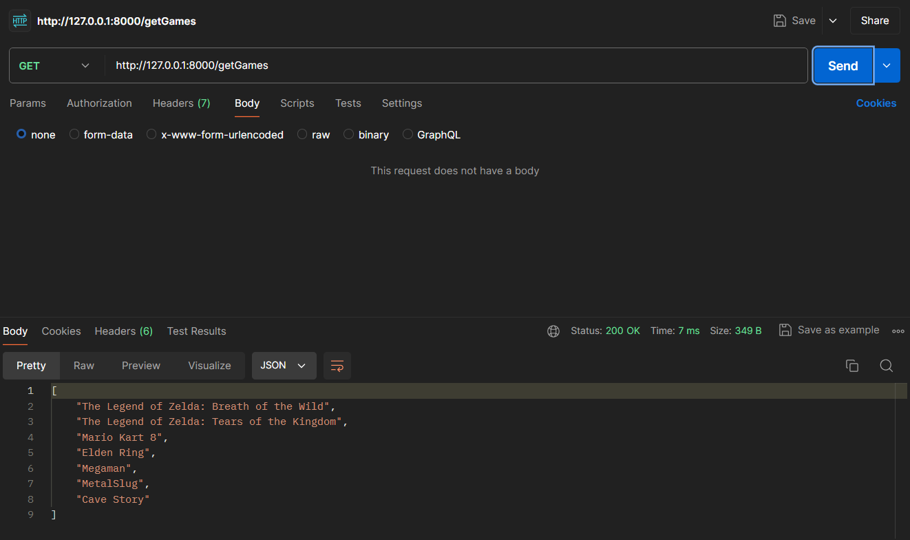

# API para ponderada de testes com Postman

&emsp;Para realização da atividade ponderada, fiz essa pequena e extremamente simples API em Flask. Ela é formada por 3 possíveis endereços para requisições:

- "http://localhost:8000/getGames": retorna a lista de títulos de jogos armazenada em seu estado atual (ou seja, com possíveis alterações feitas ou não). Simples requisição do tipo GET, não necessita de parâmetros adicionais.

<div align="center">

<sub>Exemplo de requisição GET da API</sub>


</div>

- "http://localhost:8000/addGames": permite a adição de um ou mais títulos à lista de jogos, mas não permite a adição de títulos repetidos. Os nomes devem ser enviados separados por vírgula e espaço em um *raw* HTTP POST *body*. 

<div align="center">

<sub>Exemplo de requisição POST da API</sub>


</div>

Vale ressaltar que as alterações persistem na lista de títulos de jogos contanto que a API continue em execução, como demonstrado na imagem abaixo.

<div align="center">

<sub>Novos jogos na lista de títulos</sub>



</div>

- "http://localhost:8000/deleteGame": permite a deleção de um título da lista de jogos. O nome deve ser enviado em um *raw* HTTP DELETE *body*. 

<div align="center">

<sub>Exemplo de requisição DELETE da API</sub>


</div>

Assim como com a requisição do tipo POST, os dados são realmente removidos da lista, como visto na imagem abaixo.

<div align="center">

<sub>Lista de jogos após deleção</sub>


</div>

&emsp;Para execução local da API (como feito para os testes acima), é necessário ter o [interpretador do Python e o pip](https://www.python.org/downloads/) instalados. Cumprindo esse requisito e tendo clonado o repositório, basta executar os seguintes comandos no terminal na pasta "ponderada-api/src":

```bash
# Criando um ambiente virtual para instalação das dependências (opcional, porém recomendado)
python -m venv env

# Ativando o ambiente virtual
.\env\Scripts\activate

# Instalando as dependências
pip install -r requirements.txt

# Executando a API
python app.py
```